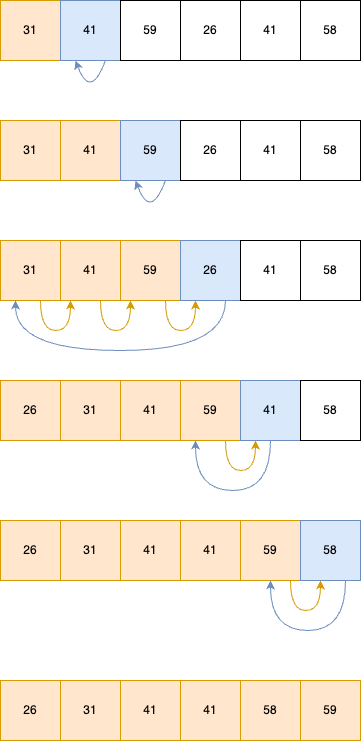

# Chapter 2
## 2.1
### 2.1-1
Using Figure 2.2 as a model, illustrate the operation of INSERTION-SORT on an array initially containing the sequence (31, 41, 59, 26, 41, 58).

**A:**<br>
 

### 2.1-2
Consider the procedure SUM-ARRAY on the facing page. It computes the sum of the n numbers in array *A[1:n]*. State a loop invariant for this procedure, and use
its initialization, maintenance, and termination properties to show that the SUMARRAY procedure returns the sum of the numbers in *A[1:n]*.

```bash
SUM-ARRAY(A, n)
1   sum = 0
2   for i = 1 to n
3       sum = sum + A[i]
4   return sum
```

**A:**<br>
**Initialization:** We start by setting *sum* to zero before the first loop iteration, when *i* = 1. Since no element of the arry is added to sum yet, *sum = 0* shows that the loop invariant is true prior to the first iteration of the loop.

**Maintenance:** The for loop works by adding *A[i]* to *sum*, which make *sum* the sum of subarray *A[1:i]*. Incrementing i for the next iteration of the for-loop then preseves the loop invariant.

**Termination:** The loop variable *i* starts at 1 and increases by 1 in each iteration. Once *i*'s value exceeds *n* in line 2, the loop terminates. Substituting *n + 1* for i in the wording of the loop invariant yield that sum of subarray *A[1:n]*. Hence, the algorithm is correct.

### 2.1-4
Consider the *searching problem*:
**Input:** A sequence of n numbers (a<sub>1</sub>,a<sub>2</sub>,...,a<sub>n</sub>) stored in array *A[1:n]* and a
value x .
**Output:** An index i such that x equals *A[i]* or the special value NIL if x does not appear in A.

Write pseudocode for linear search, which scans through the array from beginning to end, looking for x . Using a loop invariant, prove that your algorithm is correct. Make sure that your loop invariant fulûlls the three necessary properties.

**A:**<br>
**Pseudocode**
```bash
SEARCH(A, x)
1.  index = NIL
2.  for i = 1 to n
3.      if A[i] == x
4.          index = i
5.          break
6.  return index
```

**Initialization:** We start by setting index to NIL before the first loop iteration, when i = 1. Since no element of A is iterated yet, index = NILL shows the the loop invariant is true prior to the first loop iteration.

**Maintenance:** The for loop works by comparing *A[i]* with *x*; if *A[i]* does not equal to *x*, increase *i* for the next teration of the for-loop, which preseves the loop invariant.

**Termination:** The loop variable *i* starts at 1 and increases by 1 in each iteration. If *A[i]* equals to *x*, loop terminates and index value is *i*; if no array elements equals to *x*, loop termintes when *i*'s value is *n + 1*, and index's value is NIL.

### 2.1-5
Consider the problem of adding two n-bit binary integers *a* and *b*, stored in two *n*-element arrays *A[0:n-1]* and *B[0:n-1]*, where each element is either 0
or 1, *a* = $\sum_{i=0}^{n-1}$ *A[i]* $\cdot$ $2^i$, and *b* = $\sum_{i=0}^{n-1}$ *B[i]* $\cdot$ $2^i$. The sum *c = a + b* of the two integers should be stored in binary form in an *C[0:n]* array where  *a* = $\sum_{i=0}^{n-1}$ *C[i]* $\cdot$ $2^i$. Write a procedure ADD-BINARY-I NTEGERS that takes as input arrays A and B , along with the length n, and returns array C holding the sum.

**A:**<br>
**Initlaization:**
* Set everyone element of *c* to zero
* Set i to 1
* Set carry to 0

**Maintenance:**
* value = A[i] + B[i] + carry
* carry = value $\div$ 2
* C[i] = value % 2
* i = i + 1

**Termination:**
* Loop terminates when *i = n + 1*
* C[n + 1] = carry
* return C

**Pseudocode**
```bash
1.  N-BIT-BINARY-ADD(A, B, n)
2.  C = [0:n + 1]
3.  carry = 0
4.  for i = 0 to n-1
5.      value = A[i] + B[i] + carry
6.      C[i] = value % 2
7.      carry = value $\div$ 2
8.      i = i + 1
9.  C[n] = carry
10. return C
```

## 2.2
### 2.2-1
Express the function $n^3$ /1000 + 100$n^2$ - 100n + 3 in terms of $\Theta$-notation.<br>
**A:** $\Theta(n^3)$

### 2.2-2
Consider sorting n numbers stored in array A[1:n] by first finding the smallest element of A[1:n] and exchanging it with the element in A[1]. Then find the smallest element of A[2:n], and exchange it with A[2]. Then find the smallest element of A[3:n], and exchange it with A[3]. Continue in this manner for the
first n - 1 elements of A. Write pseudocode for this algorithm, which is known as ***selection sort***. What loop invariant does this algorithm maintain? Why does it need to run for only the first n - 1 elements, rather than for all n elements? Give the worst-case running time of selection sort in $\Theta$-notation. Is the best-case running time any better?

**A:**<br>
```bash
# Pseudocode   
1.    SELECTION-SORT(A, n)
2.    for i = 1 to n-1
3.        min = i
4.        for j = i + 1 to n
5.            if A[min] < A[j]
6.                min = j
7.        temp = A[i]
8.        A[i] = A[min]
9.        A[min] = temp
```

*Loop invariant*
* Initialization:
  * The iterated elements are sorted in ascend order. Before the first iteration, there's no elements sorted yet. So, this condition is true.
  * The most right of iterated elements is less than any un-iterated elements. Before the first iteration, no elements are iterated yet. We regard the most right element is NIL and less than any elements of A[1:n].
  * Thus, the loop invariant is true before the first iteration.
* Maintenance: 
  * For iteration i, we get the minimal element from A[i:n]. Suppose it's index is *m*.
  * Then exchange A[i] with A[m]. Thus, A[i] is less than any elements of A[i+1:n].
  * Also, since A[i-1] is less than any elements of A[i:n]. Thus A[i-1] is less than A[i]. Thus, A[1:i] remains in ascend order.
  * Thus, the loop invariant remains true before the next iteration (aka iteration i+1).
* Termination: The for loop terminates when i is n. The A[1:n] is in ascend order. Thus, the algorithm is correct.

It only needs to run for first n-1 elements because A[n-1] is les than A[n].

*Complexity Analysis*<br>
When i is 1, the inner for loop runs for n-1 times; when i is 2, the inner loop runs for n-2. So, for iteratio i, the inner loop runs for n-i times. The last inner loop, where i is n-1, runs for 1 time. Thus, the total running times is sum of (n-1) + (n-2) + ... + (n -i) + ... + 1. So, for A[1:n], selection sort runs for the following times:<br>

Times = $\sum_{i=1}^{n-1}$ = $n \times \frac{n-1}{2}$ = $\frac{n^2 - n}{2}$ 

So, the time complexity of insertion sort is $\Theta(n^2)$.

*Best Case*
Selection Sort is always $\Theta(n^2)$.

### 2.2-3
Consider linear search again (see Exercise 2.1-4). How many elements of the input array need to be checked on the average, assuming that the element being searched for is equally likely to be any element in the array? How about in the worst case? Using $\Theta$-notation, give the average-case and worst-case running times of linear search. Justify your answers.

**A:**
$Average = \frac{n+1}{2}$<br>
$Worst = n$

*Justification*: In worst case, either $A[i:n]$ doesn't contain the target value or $A[n]$ is the target value. Runtime for worst case is $n$. Runtime for best case is 1 when the $A[1]$ is the target value. So, the average runtime is ...<br>
$Average=\sum_{i=1}^{n} \div n = ((n + 1) \times \frac{n}{2}) \div n = \frac{n + 1}{2}$ 

### 2.2-4
How can you modify any sorting algorithm to have a good best-case running time?

**A:** Before starting the sorting process, check if the input array is already sorted. If it is, you can skip the sorting entirely. 

